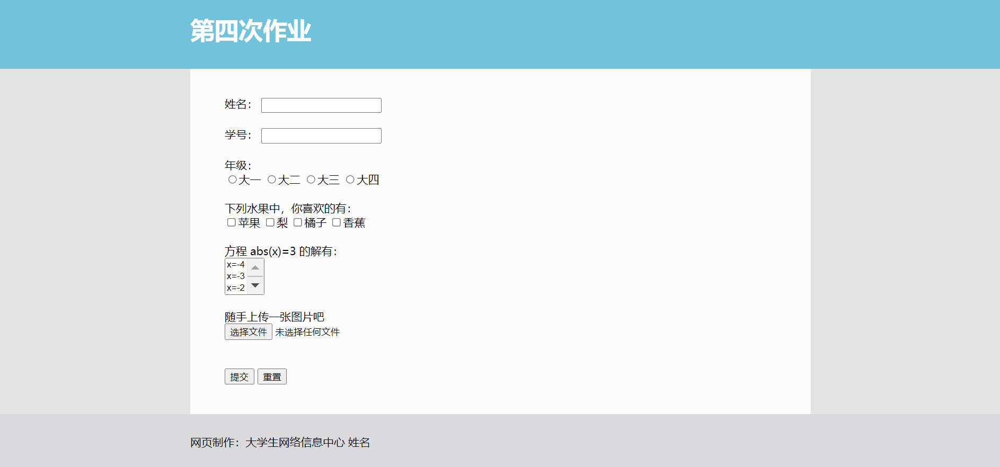

# 目录
* ## <a href="#c4">chapter4 表单知识</a>
    * ### <a href="#c4.1">4.1 什么是表单</a>
    * ### <a href="#c4.2">4.2 表单</a>
        * ### <a href="#c4.2.1">4.2.1 表单\<form>\</form></a>
        * ### <a href="#c4.2.2">4.2.2 输入（框）\<input></a>
        * ### <a href="#c4.2.3">4.2.3 文本域\<textarea>\</textarea></a>
        * ### <a href="#c4.2.4">4.2.4 选择框\<select>\<option>\</option>\</select></a>
        * ### <a href="#c4.2.5">4.2.5 按钮\<button>\</button></a>
* ## <a href="#c5">补充内容：url</a>
* ## <a href="#work">作业</a>
 

***
 
  
# <a id="c4">chapter4 表单知识</a>
## <a id="c4.1">4.1 什么是表单</a>
表单 是在网页中用以搜集用户信息的一类标签。  

工作原理/流程：  
1. 用户填写信息
2. 用户点击提交按钮
3. 浏览器将信息提交给后台
4. 后台将提交结果反馈给用户

操作一览：  
&nbsp;&nbsp;&nbsp;&nbsp;&nbsp;&nbsp;&nbsp;&nbsp;&nbsp;&nbsp;
<a href='http://fix.syau.edu.cn/'>报修平台</a>
***
<a href='http://127.0.0.1/qj/form.html'>test</a>  

form.html
> \<form action="./test11.php" method="POST">  
> &nbsp;&nbsp;&nbsp;&nbsp;\
  
> &nbsp;&nbsp;&nbsp;&nbsp;&nbsp;&nbsp;&nbsp;&nbsp;\<input type="text" name="name" value="" placeholder="请输入您的学号">  
> &nbsp;&nbsp;&nbsp;&nbsp;&nbsp;&nbsp;&nbsp;&nbsp;\
学号\
  
> &nbsp;&nbsp;&nbsp;&nbsp;\
  
> &nbsp;&nbsp;&nbsp;&nbsp;\
  
> &nbsp;&nbsp;&nbsp;&nbsp;&nbsp;&nbsp;&nbsp;&nbsp;\<input type="password" name="pwd" value="" placeholder="请输入您的统一身份认证密码">  
> &nbsp;&nbsp;&nbsp;&nbsp;&nbsp;&nbsp;&nbsp;&nbsp;\
统一身份认证密码\
  
> &nbsp;&nbsp;&nbsp;&nbsp;\
  
> &nbsp;&nbsp;&nbsp;&nbsp;\
  
> &nbsp;&nbsp;&nbsp;&nbsp;&nbsp;&nbsp;&nbsp;&nbsp;\<input type="submit" value="登录">  
> &nbsp;&nbsp;&nbsp;&nbsp;\
  
> \</form>  

test11.php
> \<?php  
> &nbsp;&nbsp;&nbsp;&nbsp;$post = $_POST;  
> &nbsp;&nbsp;&nbsp;&nbsp;var_dump($post['name']);  
> &nbsp;&nbsp;&nbsp;&nbsp;echo '\ ';  
> &nbsp;&nbsp;&nbsp;&nbsp;var_dump($post['pwd']);  
> ?>  
***
## <a id="c4.2">4.2 表单</a>
在属性中，为了达到目的，以*标识必填属性。
### <a id="c4.2.1">4.2.1 表单\<form>\</form></a>
作用：表单的框架、标明传递方式与目标地址。
属性 | 作用 | 值 
--- | --- | ---
action* | 标明传递的目标地址 | url
method* | 标明传递的方式 | POST \|\| GET
enctype | 规定编码（传递方式为POST时） | string

enctype="multipart/form-data"&nbsp;&nbsp;当上传文件时必选

method="POST"&nbsp;&nbsp;ulr中没有传递过去的参数  
method="GET"&nbsp;&nbsp;ulr中有传递过去的参数  

### <a id="c4.2.2">4.2.2 输入（框）\<input></a>
inline，搜集用户信息的主力标签。
属性 | 作用 | 值
--- | --- | ---
type* | 表明\<input>的类型 | 见下表格
name* | 标注其名称，为传递后提供索引 | string \|\| array
value | 表明\<input>的值 | string
placeholder | 占位文字 | string
readonly | 表明\<input>只读 | \\
required | 表明\<input>必填 | \\
checked | 默认选中 | \\

type的值 | 作用
-------- | ---
text | 文本输入 
password | 密码输入
radio | 单选
checkbox | 多选
file | 文件上传
submit | 提交
reset | 重置

***
Have A Try :  
<form>  
text：<input type='text' name='t'>  

password：<input type='password' name='p'>  

radio1：<input type='radio' name='r1' value='苹果'>苹果  
radio2：<input type='radio' name='r2' value='梨'>梨  

checkbox1：<input type='checkbox' name='r1[]' value='苹果'>苹果  
checkbox2：<input type='checkbox' name='r2[]' value='梨'>梨  

file：<input type='file' name='f'>  

submit：<input type='submit'>  

reset：<input type='reset'>  
</form>

***

### <a id="c4.2.3">4.2.3 文本域\<textarea>\</textarea></a>
inline，强力的文本输入框。
属性 | 作用 | 值
--- | --- | ---
name* | 标注其名称，为传递后提供索引 | string
value | 表明文本域的值 | string
placeholder | 占位文字 | string
readonly | 表明文本域只读 | \\
required | 表明文本域必填 | \\
maxlength | 规范输入字符最大值 | int
rows | 显示区域行数 | int

***
Have A Try :  
<textarea name='ta' maxlength='6' rows='5'></textarea>
***

### <a id="c4.2.4">4.2.4 选择框\<select>\<option>\</option>\</select></a>
inline，可以提供下拉菜单式的选择。  
  
\<select>\</select> 选择框的框架
属性 | 作用 | 值
--- | --- | ---
name* | 标注其名称，为传递后提供索引 | string \|\| array
required | 表明选择框必填 | \\
multiple | 允许多选 | \\
size | 显示区域行数 | int  
  
   
\<option>\</option> 选择框的选项
属性 | 作用 | 值
--- | --- | ---
value* | 表明选项的值 | string
selected | 表明选项是否选中 | \\

***
Have A Try :  
<select size='3' name='se'>
    <option value='1'>1</option>
    <option value='2'>2</option>
    <option value='3'>3</option>
    <option value='1.1'>1.1</option>
    <option value='2.1'>2.1</option>
    <option value='3.1'>3.1</option>
</select>
***

### <a id="c4.2.5">4.2.5 按钮\<button>\</button></a>
inline  
It's just a button. 

# <a id="c5">补充内容：url</a>
### What's mean?
> 统一资源定位符（Uniform Resource Locator，URL）是对可以从互联网上得到的资源的位置和访问方法的一种简洁的表示，是互联网上标准资源的地址。互联网上的每个文件都有一个唯一的URL，它包含的信息指出文件的位置以及浏览器应该怎么处理它。
### What's the frame of the *url*?
`协议://授权/路径?查询`  
`protocol://hostname[:port]/path/[?query]`  
##### for example:
http://210.47.163.202:80/snic/login.php  
https://www.so.com/s?ie=UTF-8&q=url  
### Something u should pay attention to.
1. 空格会打断url   
<a href='https://www.so.com/s ?ie=UTF-8&q=url'>https://www.so.com/s ?ie=UTF-8&q=url</a>  
可以使用 `%20` 来代替空格

2. GET传递的内容会显示在[?query]内   
js或者php可以获取到这个参数，并将其作为重要变量  
http://live.syau.edu.cn/player.html?channel=cctv3hd  
http://live.syau.edu.cn/player.html?channel=cctv13hd

3. 如果有需要的话，可以讲url中的参数进行加密  
  
     
  
# <a id="work">作业</a>
制作一个表单，表单外观如下：  

<a href='http://127.0.0.1/qj/work.html'>作业展示</a>  
  
页面布局参数说明：
1. 导航区（标题区）宽度铺满，高度100px，背景颜色#71C3DB
2. 导航区字体大小为35px，加粗，文字颜色为#FDFDFD
3. 导航区字体距页面顶部为20px
4. 主体部分背景颜色为#FCFCFC，页面背景颜色为#E1E4E1
5. 主体部分宽度为62%，最小高度为500px，居中
6. 版权区背景颜色为#DAD9DC，宽度铺满，高度为80px
7. 版权区文字字体大小为16px，距版权区顶部30px
8. 导航区与标题区的第一个文字左侧与主体部分左边对齐

主体部分内容参数说明：  
1. 表单传递地址：http://210.47.163.202/snic/work.php
2. 表单数据传递方式：POST
3. 表单需填写内容说明：  

标题 | name名  
---- | ----  
姓名 | name  
学号 | number
年级 | grade
喜欢的水果 | like[]
方程求解 | x[]
图片 | img

### 本次作业所需要做的：
1. 尽可能完成网页制作
2. 在11月13日前提交表单内容到目标地址  
3. 如果成功将表单内容传递到目标地址的话（页面会提示提交成功），请截图留念，并分析下面的一行神奇命令是什么

*P.S. 图片大小须小于100MB，方程求解结果自行搜索确认，姓名学号如实填写*

 
 
 
 
## 本次资源二维码  
  

### 作者：WoziKing
##### 沈阳农业大学 大学生网络信息中心 网络运行部